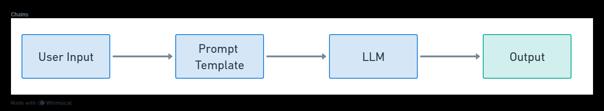

# CHAINS

Chains go beyond just one single LLM call and are sequences of calls.

Chains allows us to combine multiple components together to solve a specific task and build an entire LLM application

Eg: we can chain together a prompt template and a LLM

```python
from langchain.prompts import PromptTemplate
from langchain.llms import OpenAI

llm = OpenAI(temperature = 0.9)

template = 'How to make pasta using {ingredients}?'

prompt = PromptTemplate{ 
    input_variable = [ 'ingredients' ],
    template = template
}

from langchain.chains import LLMChain

chain = LLMChain(llm = llm, prompt =prompt)

print(chain.run ( 'White Sauce' ))
```


### Working


