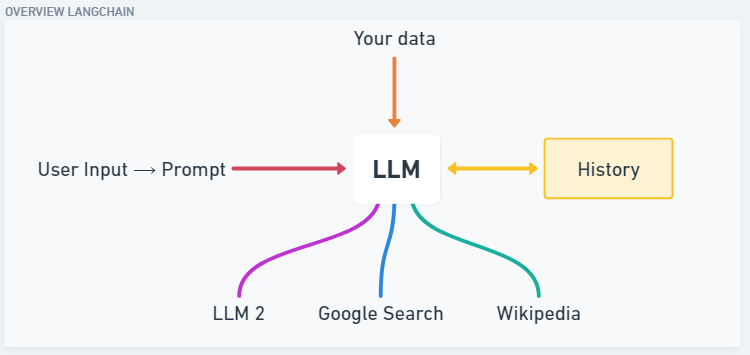

# LangChain Overview 

LangChain is an open-source framework that allows developing end-to-end applications powered by large language models.

The framework currently offers a Python or a JavaScript package, Typescript to be specific.

If we want to build an app on top of ChatGPT or any other LLM and then we wish to combine our own data (eg. a database of emails, PDFs, excel sheets) to that while also constructing prompts based on basic user input. 

Langchain also offers to store conversation history.

LangChain allows building applications with LLMs through composability.

Currently, it provides 6 different key functionality:

1. Models
2. Prompts
3. Chains
4. Memory
5. Indexes
6. Agents and Tools
