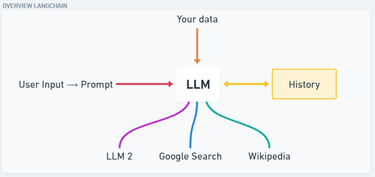
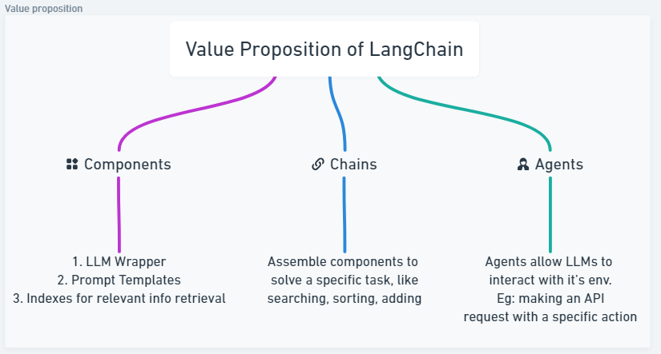
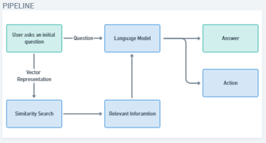

# LangChain Overview

LangChain is an open-source framework that allows developing end-to-end applications powered by large language models.

The framework currently offers a Python or a JavaScript package, Typescript to be specific.

If we want to build an app on top of ChatGPT or any other LLM and then we wish to combine our own data (eg. a database of emails, PDFs, excel sheets) to that while also constructing prompts based on basic user input.

Langchain also offers to store conversation history.

LangChain allows building applications with LLMs through composability.

Currently, it provides 6 different key functionality:

1. Models
2. Prompts
3. Chains
4. Memory
5. Indexes
6. Agents and Tools

# WHY LangChain

With ChatGPT, Google BARD and other LLMs growing in today’s AI centric world, we know that these models a general knowledge that makes them answer anything but what if we want to talk to our own document (file, book, database) that is not in the knowledge of these LLMs.

LangChain allows a LLM Model like GPT4 to be integrated with your own source of data. Once we have the information we need we can use LangChain to take the action we want to it to take.

Eg: Sending an email

This process happens by taking the document to the reference and slicing it up into smaller chunks and then storing those chunks in a Vector database.

The chunks are stored as embeddings, i.e., they are the vector representations of the text.

This allows one to build language model applications that follow a general pipeline:

1. User starts by asking an initial question
2. That question is fed to the language model
3. The question is also sent for similarity search by taking the vector representation of that
4. After the similarity search is completed, we take out the relevant information and that is fed to the language model.
5. Now, the language model has both the question and the relevant information, with all this it can answer the question as well as take any relevant action that is required or asked.

Thus LangChain helps build applications that follow a pipeline like mentioned above. These applications are both  **data aware** , we can reference our own data in a vector store and are **agentic** they can take actions and not only provide answers to questions.

Some practical use cases are:

1. Flight booking
2. Studying
3. Coding
4. Money Transfer
5. Analysis
6. Pay taxes
